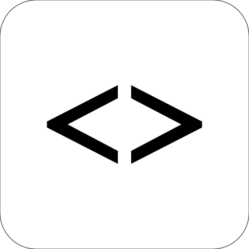
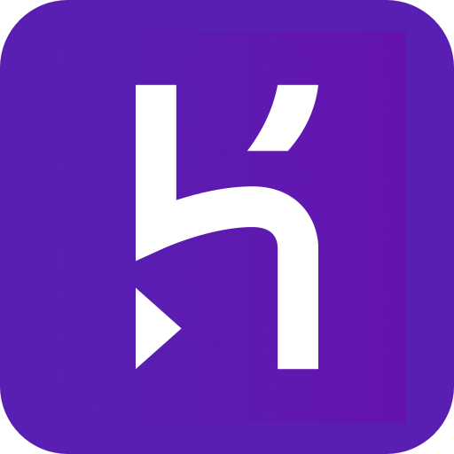
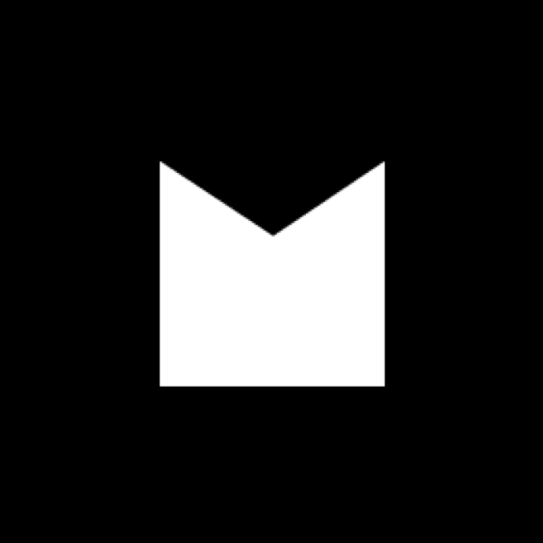
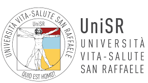
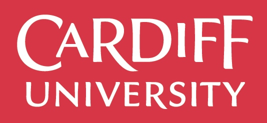

<h1 align="center">Oliver Cripps</h1>
<h4 align="center">Junior Developer</h4>
 

<ul align="center">

[Background](#background) |
[Projects](#projects) |
[Websites](#websites) |
[Skills](#skills) |
[Experience](#experience) |
[Education](#education) |
[Interests](#interests)

</ul>

## Background

I love discovering how things work and then learning how to make them myself. My passion for tech began with a Christmas card made in Microsoft Paint back in 1995, followed by a GTA cheatcode website a year later. Since then I've been developing my creativity and professional skillset across medical and financial disciplines.

Working in Investor Relations gave me solid grounding in several key professional areas, managing high-stakes projects with C-suite level stakeholders and working efficiently under pressure. I also had the opportunity to manage several creative and technical projects further feeding my love for and interest in working in tech.

I'm excited to join a company delivering innovative projects with intelligent design where I can express my creativity and attention to detail as well as continuing my personal learning journey.

## Projects

Name | Description | Tech | Timeframe | Demo
---| --- | --- | --- | --- |
**[Dinnergy](https://github.com/ocripps24/dinnergy)** | Final group project building a food waste and planning app in Apple's Swift language. Users add thier ingredients to receive recipes based on what they currently have. I discuss some of the challenges faced in my <a href="http://www.olivercripps.com/2019/06/dinnergy-app-our-final-project-at-makers/">blog.</a> | Swift, XCTest, Xcode, SQLite, SwiftLint, Travis | 2 weeks (group) |  |
**[Bearbook](https://github.com/ocripps24/Acebook-The-Brave-Bears)** | Acebook is a social media clone featuring user walls, posts and comments. It was a group engineering project with a focus on Agile and High Quality processes. | Ruby on Rails, RSpec, Capybara, Travis, Rubocop, PSQL | 2 weeks (group) |  |
**[MakersBnB](https://github.com/ocripps24/MakersBnb)** | A simple clone of AirBnB with signup/login and adding / editing / viewing listings as features. Our first group engineering project with just 4 days to work with and a new tech stack represented a genuine challenge. Further discussion on my <a href="http://www.olivercripps.com/2019/06/makersbnb-engineering-project/">blog.</a> | JavaScript, Node.js, Express, HTML (Pug), CSS, Nightwatch, Jasmine | 1 week (group) |  |
**[Instagram Clone](https://github.com/ocripps24/instagram-clone)** | Following the excitement of building the Netflix clone, I wanted to continue my exploration of Dart / Flutter by creating this clone of the Instagram UI. I learnt several new concepts and felt much more comfortable working with Flutter this time around. | Flutter / Dart | 2-3 days (solo) |  |
**[Netflix Clone](https://github.com/ocripps24/netflix-clone)** | After attending a Flutter meetup, I was excited to see what could be achieved with the language and I wanted to try it myself by building the home page UI of a popular tech service, alongside a tutorial. | Flutter / Dart | 2-3 days (solo) |  |

## Websites

Name | Description | Tech | Role | Link
---| --- | --- | --- | --- |
**[Udugu Website](https://github.com/ocripps24/udugu)** | Development of a client website built using Semplice and custom HTML/CSS elements. A few elements from the custom code base are shown in the repo. I've explored the process in more detail in this <a href="http://www.olivercripps.com/2019/04/udugu-website/">blog post.</a> | Wordpress, HTML, CSS | Design, Development, Deployment |  |
**Mediatree Website** | I lead the redevelopment of Mediatree's <a href="https://www.cssdesignawards.com/sites/mediatree/34667/">award-winning</a> new company website, working on every aspect of the process aside from the development. I have written a blog post expanding on the project <a href="http://www.olivercripps.com/2019/06/mediatrees-new-home/">here.</a> | Ajax, HTML, CSS, Wordpress | Project Director |  |

## Skills

#### Analytical thinking

Through medical school and now working with code, I have built strong analytical frameworks to diagnose issues methodically and construct a pathway to solve and move beyond issues/errors. Particularly as a result of using TDD, I have grown to enjoy debugging. It is an important part of my learning process and I enjoy applying my cross-disciplinary skills to aid this process.

- Most recently I fixed our first group <a href="https://github.com/ocripps24/MakersBnb">project</a> that had broken and whose instructions had gone missing.
- I started by reviewing the documentation for the frameworks to rebuild the instruction base and continued by debugging each of the broken tests until they passed. I finished by connecting the project to Travis.

#### Creativity

I take great satisfaction from building things with creative and intelligent design. My creativity stems from a desire and perseverance to understand how something works and the challenge of learning new skills in the pursuit of creation. This is particularly true with graphic design software.

- After driving an increase in design projects at my previous employer, I had to adapt and teach myself how to use several of the Adobe Creative Cloud apps to meet demand, facilitate faster project turnaround and often make live changes or suggestions during client meetings.
- When faced with a recent client <a href="http://www.udugufs.com/">website</a> project without the resources for a designer, I applied my skills to create the entire website design from scratch ensuring that it adhered to their brand guidelines and tone of audience.
- Created booklets for company thinktank events, client presentations, branding elements as well as extending the work of other designers in various capacities.

#### Self-directed Learner

I have always had a passion for learning and been able to dictate my own self-driven learning plans and goals. My time at Makers has enabled me to expand upon these skills while considering new concepts like 'Mastery'. During my time at Makers, I had to use these skills alongside a growth mindset to stay on top of the course materials.

- Able to break higher learning goals into researchable chunks and identify helpful documentation. I also choose to keep a learning log and reflect on my progress when taking on substantial learning objectives.
- Completed 100+ hours of studying to attain a Certificate in UK Corporate Investor Relations from the IR Society.
- Consistently engage with Massive Open Online Courses covering a variety of personal interests.

## Experience

   
**Makers Academy** (March-19 to Jun-19)   
*A 16 week intensive developer bootcamp*

- Intensive exposure to languages including Ruby, JavaScript and Swift alongside frameworks like Rails.
- High-Quality processes such as TDD, Agile software development and Extreme Programming (XP)
- Collaborative working via pair-programming and group engineering projects
- Core development concepts/workflows: CI/CD, MVC, OOP, SOLID, testing, typing fluency, git and debugging

   
**Mediatree** (Oct-15 to Mar-19)    
*Several roles ending as Business Development Manager*  
- Origination – Pipeline research, creation of pitch documents, client pitch meetings and contracting of new clients.
- Budgeting – Creation and management of budgets between £5,000 and £300,000 as the Project Director.
- Project management – development of project timetables, chairing steering meetings and co-ordination of stakeholders.
- Strategy – Research and creation of new business areas, contribution to company strategy and implementation of new policies.
- Teamwork – Managed a team of five in roles ranging from daily tasks and cross-department workflows to project direction and professional development.
- Training – Contributed to onboarding of new staff, direction of future development needs and training organisation.
- Thinktank – Lead role in formation of the company thinktank, content creation and internal event planning.    
- Website – Project Direction of new company website, including content, design, development, management and training.
- Design – Lead on design projects (presentations, websites, misc. graphic design), of institutional investor facing materials.
- IT – Implementation of new technologies, co-ordination of overall strategy, staff training and internal support.
- Key projects – ALD IPO, Altran Investor Day, Ardian Presentation Support, Astorg AGM, Azora IPO, Carrefour Investor Day, Coface Investor Day, Ingenico Group Investor Day, JBCM corporate website, SMCP IPO, Eranove IPO, Showroomprive slide design.

## Education

   
**Vita-Salute San Raffaele University** (2011 to 2015)   
*International Medicine (MD) - Incomplete*
- Developed extensive listening and analytical skills through patient interaction as well as skills in research and working in complex collaborative environments discussing patient cases.
- As the elected class representative during my second year, I oversaw the organisation of a collective effort note taking system adopted by all students and held regular meetings with the course directors.

   
**Cardiff University** (2007 to 2010)   
*BSc Business Management*

- Modules included – Marketing & Strategy, Operations Management, Managerial Accounting & Finance, Strategic Management,
Human Resource Management and Entrepreneurship and Small Business Development.

**Sherborne School** (2002 to 2007)

- A-Levels - History (A + 100% in a major coursework); Economics (B) and English Literature (B)
- GCSEs - Biology (A); Chemistry (A); Physics (A); Maths (A); History (A); French (A); Spanish (A); Latin (A); English (B)

**Other qualifications**

- Investor Relations Society – Certificate in UK Corporate Investor Relations (Nov-16)

## Interests

**Volunteering**

Activities including the London Landmarks half marathon raising money for The Royal Marines Charity and visiting orphanages in Bali whilst raising money for the Solemen charity.  

**Sports**

Final of National Rugby Competition under 15s level, which was played at Twickenham. County rugby for Dorset and divisional Dorset and Wilts. 1st XV Rugby for 2 years at Sherborne School. Participated in university football tournaments.

**Royal Marines Cadets**

Non-Commissioned Officer in charge of my own section responsible for teaching weapon handling, blank round fire section attacks, parade and survival drills. Also accepted onto a prestigous summer training camp at Garelochhead.
