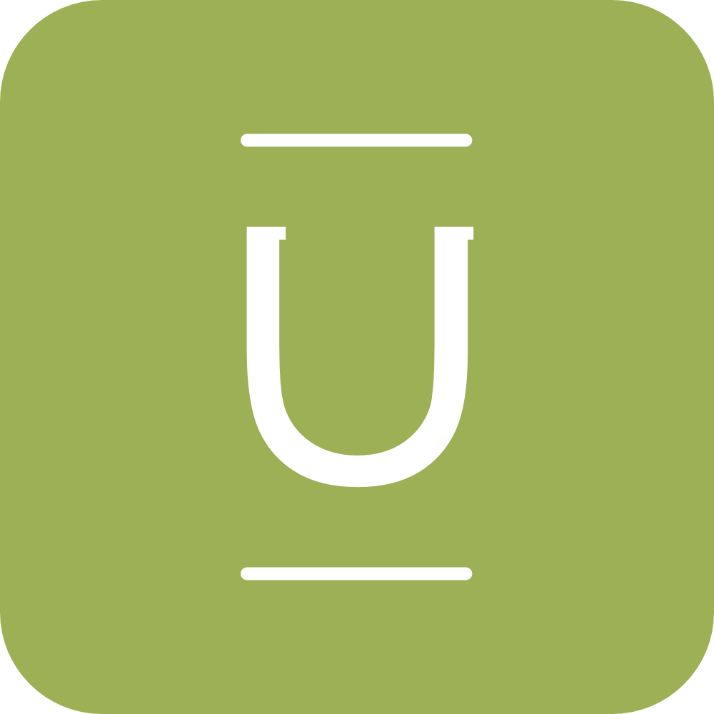

<h1 align="center">Oliver Cripps</h1>
<h4 align="center">Junior Developer</h4>
 

<ul align="center">
[Projects ](#projects) |
[Skills ](#skills) |
[Education ](#education) |
[Experience ](#experience) |
[Extra Curricular](#extra_curricular)
</ul>

E.G. A sentence about who and what you are.
-
Then a sentence about what you've achieved.
-
And then a sentence about what you're looking for: what you would ideally be doing, with whom and in what environment.
-

## Projects

Name | Description | Tech | Timeframe | Demo
---| --- | --- | --- | --- |
**[Dinnergy](https://github.com/ocripps24/dinnergy)** | Final group project building a food waste and planning app in Apple's Swift language. | Swift, XCTest, Xcode | 2 weeks (group) |  |
**[Bearbook](https://github.com/ocripps24/Acebook-The-Brave-Bears)** | Acebook is a social media clone featuring user walls, posts and comments. It was a group engineering project with a focus on Agile and High Quality processes. | Ruby on Rails, RSpec, Capybara, Travis | 2 weeks (group) |  |
**[MakersBnB](https://github.com/ocripps24/MakersBnb)** | Group engineering project ... | JavaScript, HTML (Pug), CSS, Nightwatch, Jasmine | 1 week (group) |  |
**[Instagram Clone](https://github.com/ocripps24/instagram-clone)** | Standalone project working with Flutter | Flutter / Dart | 2-3 days (solo) |  |
**[Netflix Clone](https://github.com/ocripps24/netflix-clone)** | Standalone project working with Flutter | Flutter / Dart | 2-3 days (solo) |  |

## Websites

Name | Description | Tech | Role | Link
---| --- | --- | --- | --- |
**[Udugu Website](https://github.com/ocripps24/udugu)** | Development of a client website built using Semplice and custom HTML/CSS elements. A few elements from the custom code base are shown in the repo. | Wordpress, HTML, CSS | Design, Development, Deployment |  |
**Mediatree Website** | I lead the redevelopment of Mediatree's award-winning new company website, working on every aspect of the process aside from the development. I have written a blog post expanding on the project <a href="http://www.olivercripps.com/2019/06/mediatrees-new-home/">here.</a> | Ajax, HTML, CSS, Wordpress | Project Director |  |

## Skills

#### This Skill

E.G. Descriptive paragraph of how capable you are at this skill and, if relevant, how it has developed.

- E.G. Experience
- E.G. Achievements
- E.G. Evidence

#### Another Skill

E.G. Descriptive paragraph of how capable you are at this skill and, if relevant, how it has developed.

- E.G. I achieved A during my work at B (job, or otherwise)
- E.G. I contributed to the growth of X while doing Y (job, or otherwise)
- E.G. I built this, made this, broke this, fixed this, etc.
- E.G. A link to some on-line evidence (blogs, videos, articles, etc.)

## Education

**Makers Academy** (March-19 to Jun-19)

- E.G. Curious and passionate about code. [PROVIDE EVIDENCE]
- E.G. Fast, independent learner [PROVIDE EVIDENCE]
- E.G. Great collaborator [PROVIDE EVIDENCE]

- E.G. OOP, TDD, MVC, DDD
- E.G. Agile/XP
- E.G. Ruby, Rails, JavaScript
- E.G. RSpec, Jasmine

**Vita-Salute San Raffaele University** (2011 to 2015)

- International Medicine (MD) I developed extensive listening and analytical skills through patient interaction as well as skills in research and working in complex collaborative environments discussing patient cases. I
- As the elected class representative during my second year, I oversaw the organisation of a collective effort note taking system adopted by all students and held regular meetings with the course directors.

**Cardiff University** (2007 to 2010)

- BSc Business Management

**Sherborne School** (2002 to 2007)

- A-Levels - History (A + 100% in a major coursework); Economics (B) and English Literature (B)
- GCSEs - Biology (A); Chemistry (A); Physics (A); Maths (A); History (A); French (A); Spanish (A); Latin (A); English (B)

**Other qualifications**

- Investor Relations Society – Certificate in UK Corporate Investor Relations (Nov-16)

## Experience

**Mediatree** (Oct-15 to Mar-19)    
*Several roles ending as Business Development Manager*  
- Origination – pipeline research, creation of pitch documents, client pitch meetings and contracting of new clients.
- Budgeting – creation and management of budgets between £5,000 and £300,000 as the Project Director.
- Project management – development of project timetables, chairing steering meetings and co-ordination of stakeholders.
- Strategy – research and creation of new business areas, contribution to company strategy and implementation of new policies.
- Teamwork – I managed a team of five in roles ranging from daily tasks and cross-department workflows to project direction and professional development.
- Training – I contributed to onboarding of new staff, direction of future development needs and training organisation.
- Thinktank – lead role in formation of the company thinktank, content creation and internal event planning.    
- Website – Project Direction of new company website, including content, design, development, management and training.
- Design – lead on design projects (presentations, websites, misc. graphic design), of institutional investor facing materials.
- IT – implementation of new technologies, co-ordination of overall strategy, staff training and internal support.
- Key projects – ALD IPO, Altran Investor Day, Ardian Presentation Support, Astorg AGM, Azora IPO, Carrefour Investor Day, Coface Investor Day, Ingenico Group Investor Day, JBCM corporate website, SMCP IPO, Eranove IPO, Showroomprive slide design.

## Extra Curricular

**Sports**
- Final of National Rugby Competition under 15s level, which was played at Twickenham. County rugby for Dorset and divisional Dorset and Wilts. 1st XV Rugby for 2 years at Sherborne School. Participated in university football tournaments.

**Royal Marine Cadets**
- Non-Commissioned Officer in charge of my own section responsible for teaching weapon handling, blank round fire section attacks, parade and survival drills. Also accepted onto a prestigous summer training camp at Garelochhead.
